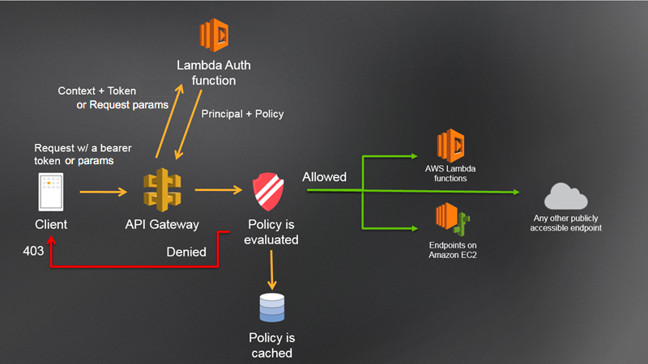
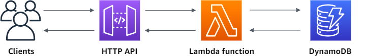

# REST API for login and account creation

AWS services used,
- AWS API Gateway for REST API
- authentication with lambda Custom Authorizer
- account creation with backend lambda function
- AWS DynamoDB for persistent storage

## Java
Not available in the Lambda console. Use the AuthPolicy object to generate and serialize IAM policies for your custom authorizer. See javadoc comments for more details.

## Lambda Custom Authorizer

## DynamoDB for persistent storage
User info is stored in DynamoDB

Here is a sample JSON view of a user info.

{
"user": {
"S": "UC18G27K8"
},
"info": {
"M": {
"email": {
"S": "ychen@ghx.com"
},
"name": {
"S": "ychen"
},
"real_name": {
"S": "Yu Chen"
} }}}

## Docs and References ##
For more details, see public documentation for:
- API Gateway Custom Authorizers
- Use API Gateway Lambda authorizers
  https://docs.aws.amazon.com/apigateway/latest/developerguide/apigateway-use-lambda-authorizer.html
  [Blog Post](https://aws.amazon.com/blogs/compute/introducing-custom-authorizers-in-amazon-api-gateway/) -- [Developer Guide](http://docs.aws.amazon.com/apigateway/latest/developerguide/use-custom-authorizer.html)
- https://jwt.io/
- Tutorial: Build a CRUD API with Lambda and DynamoDB
  https://docs.aws.amazon.com/apigateway/latest/developerguide/http-api-dynamo-db.html#http-api-dynamo-db-create-routes